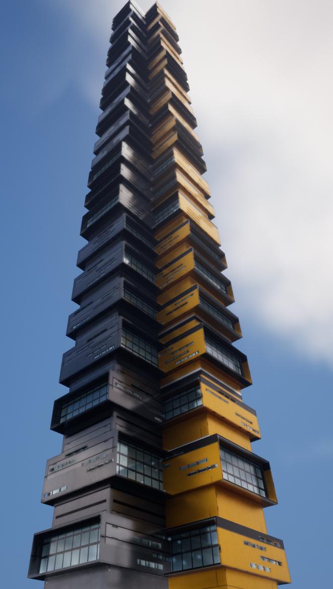
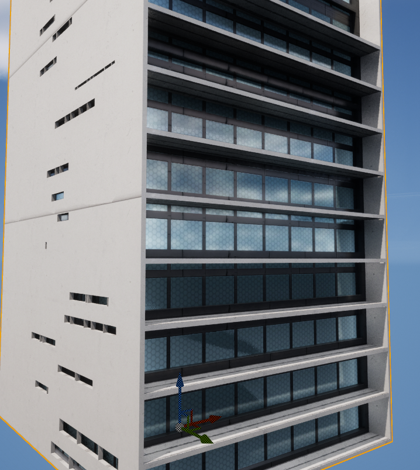
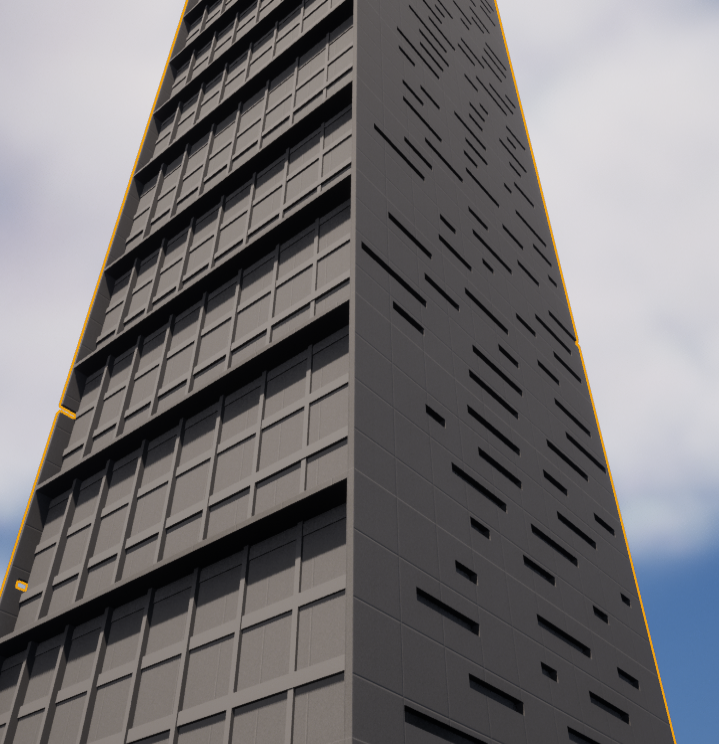
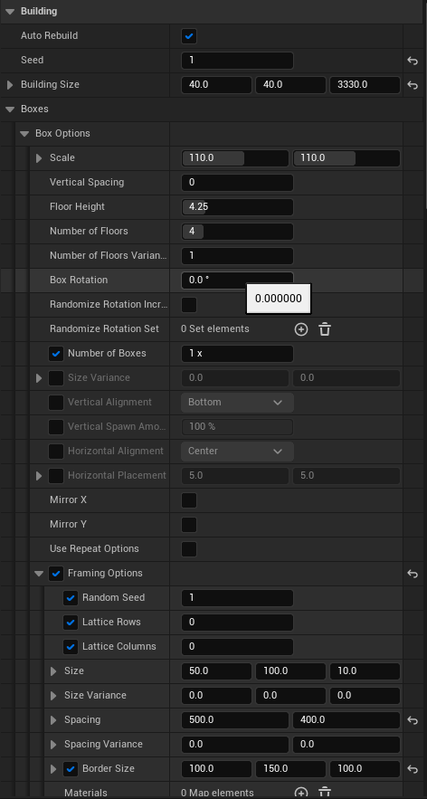
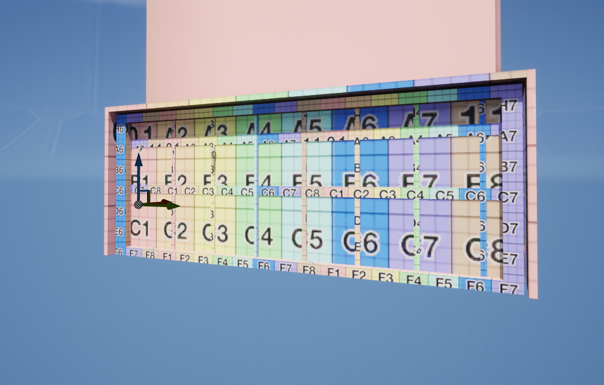
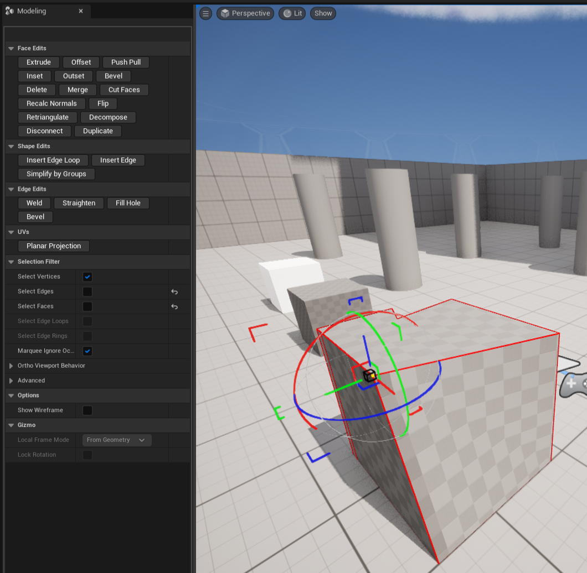

# UE5 Procedural Building Example
This small project uses `UDynamicMesh` objects and the corresponding geometry API's introduced in **Unreal Engine 5** to create an in-editor procedural building.

The project is entirely written in C++ and uses a single Actor placed in the level to render building geometry dynamically.








## About the Project 
This project was a proof of concept to understand performance, pitfalls, and to develop and understanding of the procedural tools available in UE5.

This project was built with Unreal 5, version `5.0.3` - Some API's have changed in newer versions of the engine. 
You will need to make small modifications if you wish to use the geometry code in newer versions of the Engine.


## Using the Code
It should be noted that I experimented with various ideas while writing the procedural logic. Don't assume my approach was best or perfectly thought out, I was learning as I went!

When looking at the code start with [DynamicBuilding.h](DynamicBuilding.h) and [DynamicBuilding.cpp](DynamicBuilding.cpp)

`ADynamicBuilding` is an Actor that when placed in the level will spawn/build the procedural building.

```c++
class PROCEDURALBUILDINGS_API ADynamicBuilding : public ADynamicMeshActor {}
```

A Details Panel on the Actor class allows you to configure the Procedural Building in editor.



The editor features a `seed` which allows to get consistent randomness while you change various aspects of the building.

The details panel is quite complex, you should start with `Building->Boxes->Box Options->Number Of Boxes` set to `1x` or `2x`. If you fail to heed this advice you may experience long delays while the code blocks the game loop during the construction of the building.


### Geometry API
Unreal has an internal pool for dynamic mesh objects, you should consume, and then release to this pool:
```c++
// Get a new mesh
UDynamicMesh* TempMesh = AllocateComputeMesh();
// Release mesh back to the pool
ReleaseComputeMesh(TempMesh);
```

The API Functions for mesh operations are fairly simple... for example to merge two `UDynamicMesh` objects
```c++
UGeometryScriptLibrary_MeshBasicEditFunctions::AppendMesh(
    PanelMesh,
    TempMesh,
    PanelBoxTransform
);
```

It is also worth exploring/reading the Unreal Engine code found in these headers:

```c++
#include "GeometryScript/MeshPrimitiveFunctions.h"
#include "GeometryScript/MeshBasicEditFunctions.h"
#include "GeometryScript/MeshTransformFunctions.h"
#include "GeometryScript/MeshQueryFunctions.h"
#include "GeometryScript/MeshUVFunctions.h"
#include "GeometryScript/MeshMaterialFunctions.h"
#include "DynamicMesh/MeshTransforms.h"
#include "DynamicMesh/DynamicMeshAttributeSet.h"
#include "DynamicMesh/DynamicMesh3.h"
```

## Thoughts / Advice
Overall the Geometry API's and functions are well laid out, well organized, and easy to understand.

Some functions that perform mesh operations / modifications require you to provide an anonymous function as an argument. This can be a bit cumbersome at first. The reason for this seems to be to trigger events at the beginning and end of modification to a particular dynamic mesh.

Geometry scripting can also be performed in Python, but because many small operations are required in "tight loops" with procedural generation I suspect this may be somewhat slow.

### Performance
Generating the more complex buildings pictured in the images above can get pretty slow (30+ seconds).  The majority of the time is spent in UV assignment / material channels.
There is no reason to weld all geometry together into a single object, but this is what I'm doing, and it is quite costly.

There is no caching in my solution, so I regenerate everything each time you make a chance to any setting.  Ideally the procedural building generation would know what needed to be regenerated or what "piece" was 
affected.

Batching is another solution that would greatly speed up the procedural generation. Generally speaking, when composing each of the building elements, they don't all need to be unique when there are hundreds of them.
Creating 10 unique "boxes" and then reusing them randomly would be a much better solution.

Placing pending geometry operations in a Queue, and then performing the operations over time would be a huge improvement to this code. Not only would it keep the UI responsive, but it would allow the person using the editor to interrupt an operation that was taking too long. Placing any operations in a separate thread would also be preferable.

UV Scaling and material id assignments are some of the most expensive operations. Creating the model and applying UV's should be separate operations for responsiveness.  


### Unreal 5 Procedural Nodes
With the new procedural node system it may be worthwhile to develop custom nodes. I suspect for hard surface modeling this would create very complex nodes very quickly because the number of complex math operations
needed to calculate placement is much greater than simply placing objects along the ground.

A mixture of the procedural node system and a custom procedural editor might be a more reasonable approach.

### Hard Surface Editor
My conclusion after building this tool, and trying to encapsulate the settings for a single style of building in a single Actor / Details Panel is this:
- It's wasteful and time consuming to develop custom code for a "style" of building.  There are just too many factors to consider, and the end product isn't very modular or reusable.
- A Details Panel isn't very obvious when it contains tens of settings.  What do all the settings do, where do I start. This isn't ideal for an artist pipeline.
- A Node editor as a metaphor for procedural buildings is somewhat over simplified, so I don't think procedural buildings being 100% driven by a node editor would be very maintainable or efficient either.

My thought is developing a custom editor that features stacks of settings and options and an interactive UI where faces, edges, and layout can be determined with parameters, and then randomization can be added is the right approach.

This custom editor could:
- Be optimized for hard surface modeling
- Perform caching and batching automatically
- Provide interactive UV mapping, and Material Assignment for better artist workflow
- Integrate with nodes, or a stack-based system like Niagra, where randomization, placement, occlusion can all be configured via in-editor controls using procedural friendly settings like: "north-wall, 50% width, 50% height, align bottom".
- Modules can be written for the custom editor, for example "greebles" can simply be a module that is added to the stack that does the work of rendering greebles with the placement / scale defined visually in the editor.
- Feedback becomes instant as the artist works, generating randomization for the "entire" object (floors of a building) could be deferred automatically.
- Logic to intelligently produce components such as "floors" of a building as unique static meshes could provide optimization for runtime assets. 
- Integrating with more sophisticated texturing stragies like UDIM textures automatically.

The custom hard surface editor / building editor would resemble the geometry tools that Epic created for the engine




### Next Steps
My plan is to experiment with a custom editor next. If this achieves the goals I have in mind I plan to release it to the Unreal Marketplace.


## Using The Geometry API's 
To make use of the geometry API's in your Unreal Project you need to do a couple things...

### Configure `PublicDependencyModuleNames`

Add `"GeometryScriptingEditor"`, `"GeometryScriptingCore"`, and `"GeometryCore"` to `PublicDependencyModuleNames` in your **build.cs** file.

For example:
```
PublicDependencyModuleNames.AddRange(new string[] {
    "Core", "CoreUObject", "Engine", "InputCore", "HeadMountedDisplay", "NavigationSystem", "AIModule", "Niagara", "GeometryScriptingEditor", "GeometryScriptingCore", "GeometryCore" });
```

### Enable the Geometry scripting plugin in your Project
Open the settings for your poject, navigate to plugins and ensure the **Geometry Script** plugin is enabled.

